# OpenWork 架构图表

本文档包含 OpenWork 项目所有架构的 Mermaid 图表。

---

## 1. 系统架构图

### 1.1 Monorepo 结构

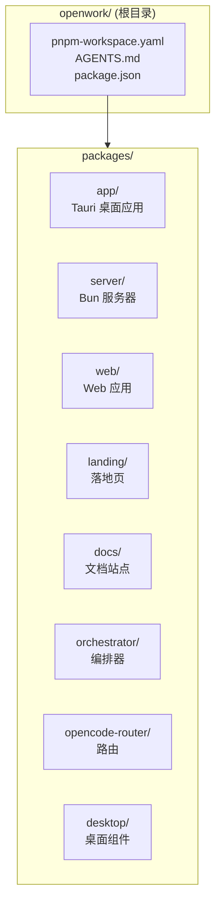

### 1.2 整体架构

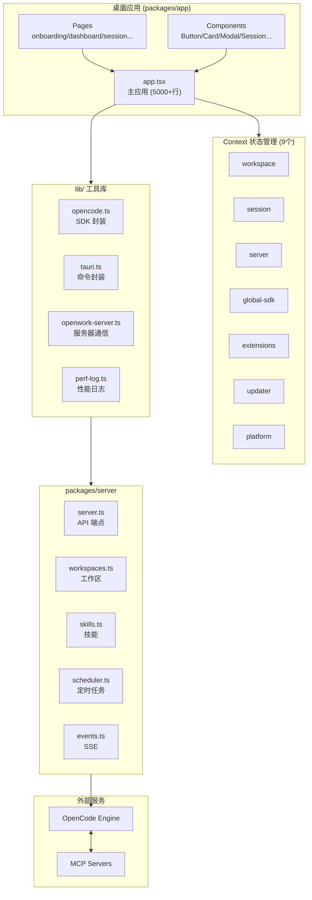

---

## 2. 页面路由图

### 2.1 路由结构

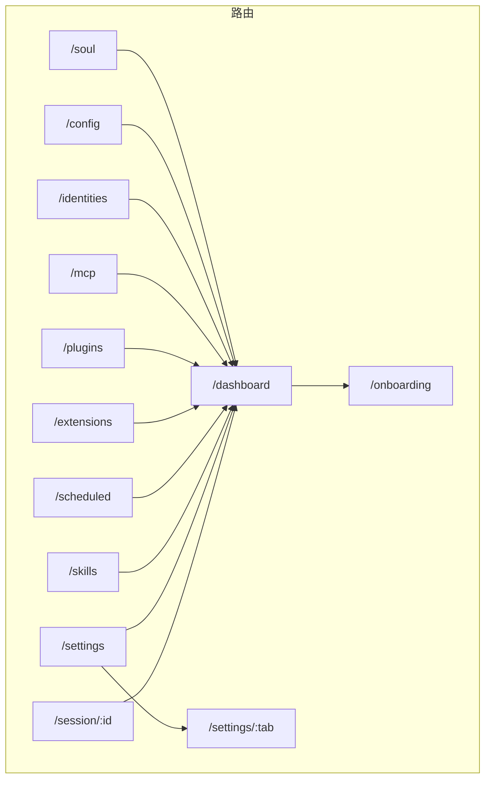

---

## 3. 状态管理图

### 3.1 Context 关系

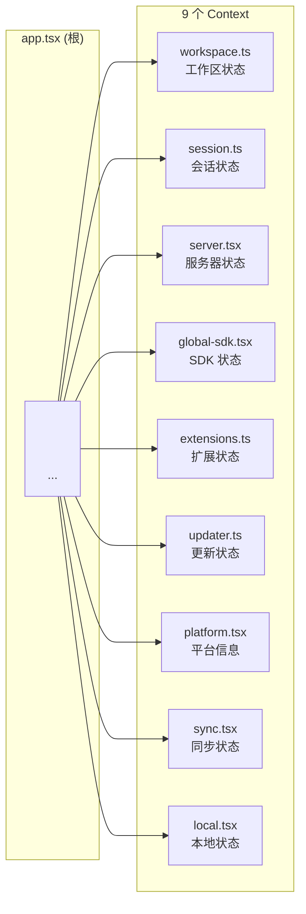

### 3.2 状态持久化

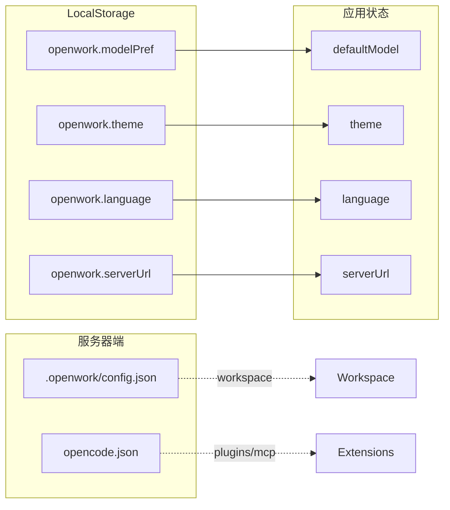

---

## 4. 会话交互流程

### 4.1 消息发送流程

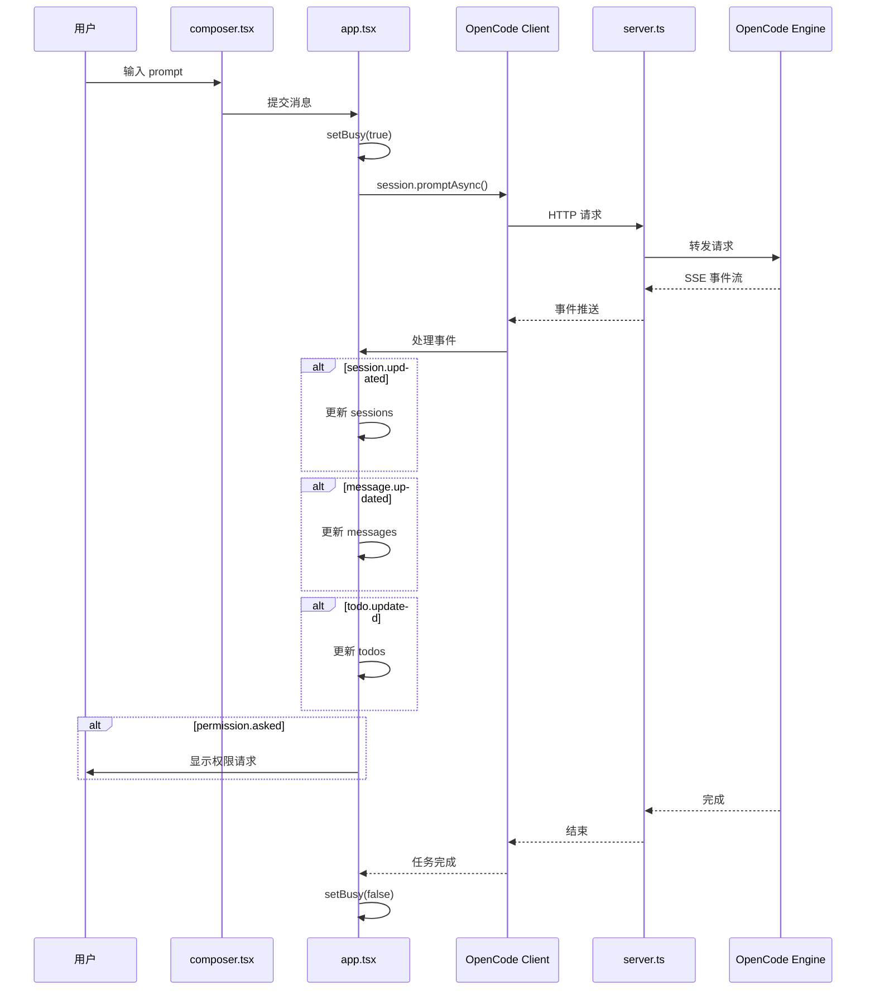

### 4.2 服务器连接流程

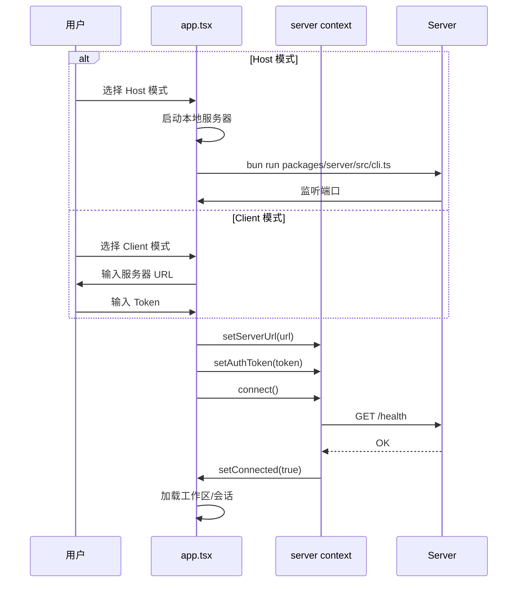

---

## 5. 组件关系图

### 5.1 app.tsx 组件树

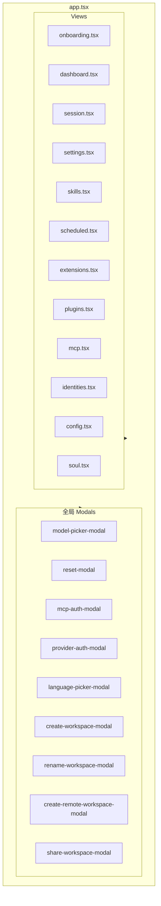

### 5.2 Session 组件

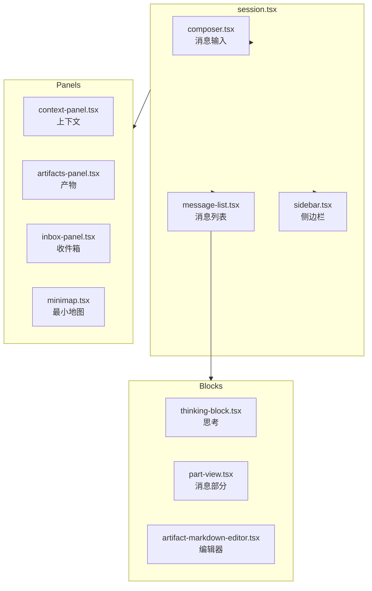

---

## 6. 服务器 API 图

### 6.1 API 端点

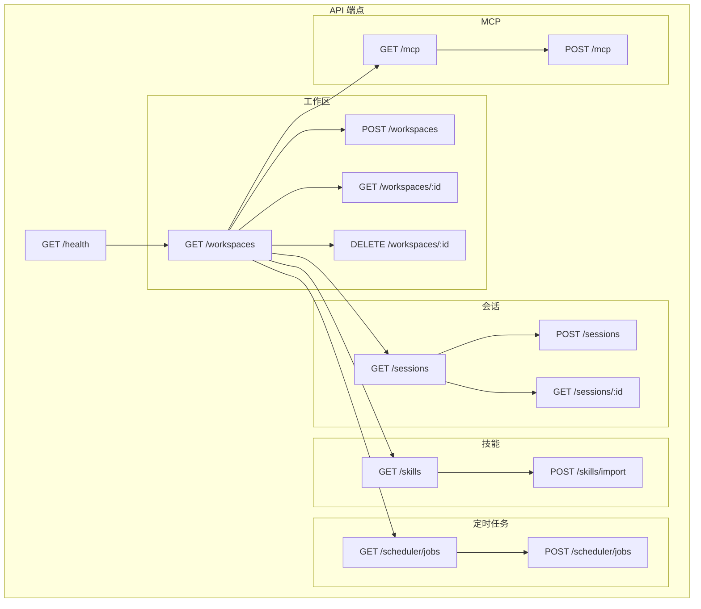

---

## 7. 权限架构图

### 7.1 认证层级

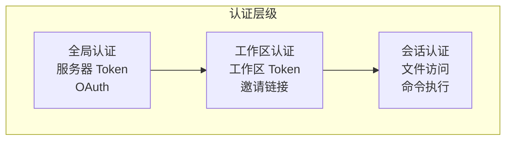

---

## 8. 部署架构图

### 8.1 部署模式

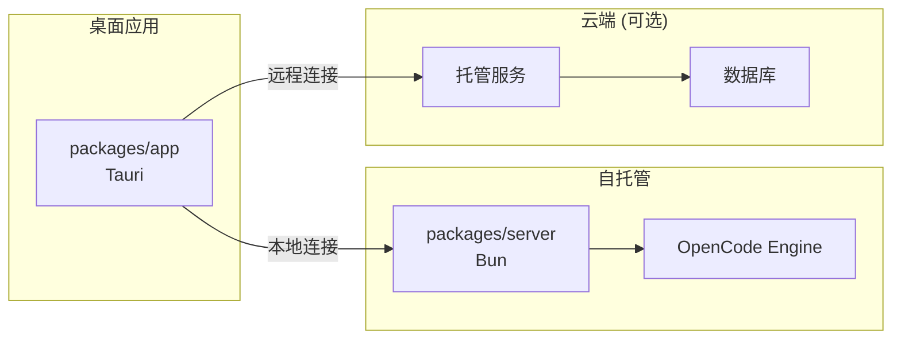

---

*本文档最后更新于 2026-02-24*
